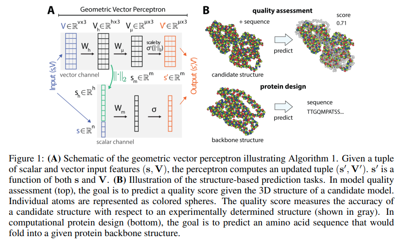

</img>

## Geometric Vector Perceptron (wip)

Implementation of <a href="https://openreview.net/forum?id=1YLJDvSx6J4">Geometric Vector Perceptron</a>, a simple circuit with 3d rotation equivariance for learning over large biomolecules, in Pytorch. The repository may also contain experimentation to see if this could be easily extended to self-attention.

## Install

```bash
$ pip install geometric-vector-perceptron
```

### Functionality
* `GVP`: Implementing the basic geometric vector perceptron.
* `GVPDropout`: Adapted dropout for GVP in MPNN context
* `GVPLayerNorm`: Adapted LayerNorm for GVP in MPNN context

## Usage

```python
import torch
from geometric_vector_perceptron import GVP

model = GVP(
    dim_vectors_in = 1024,
    dim_feats_in = 512,
    dim_vectors_out = 256,
    dim_feats_out = 512
)

feats, vectors = (torch.randn(1, 512), torch.randn(1, 1024, 3))

feats_out, vectors_out = model(feats, vectors) # (1, 256), (1, 512, 3)
```

With the specialized dropout and layernorm as described in the paper

```python
import torch
from torch import nn
from geometric_vector_perceptron import GVP, GVPDropout, GVPLayerNorm

model = GVP(
    dim_vectors_in = 1024,
    dim_feats_in = 512,
    dim_vectors_out = 256,
    dim_feats_out = 512
)

dropout = GVPDropout(0.2)
norm = GVPLayerNorm(512)

feats, vectors = (torch.randn(1, 512), torch.randn(1, 1024, 3))

feats, vectors = model(feats, vectors)
feats, vectors = dropout(feats, vectors)
feats, vectors = norm(feats, vectors)  # (1, 256), (1, 512, 3)
```

#### TF implementation:

The original implementation in TF by the paper authors can be found here: https://github.com/drorlab/gvp/

## Citations

```bibtex
@inproceedings{
    anonymous2021learning,
    title={Learning from Protein Structure with Geometric Vector Perceptrons},
    author={Anonymous},
    booktitle={Submitted to International Conference on Learning Representations},
    year={2021},
    url={https://openreview.net/forum?id=1YLJDvSx6J4},
    note={under review}
}
```
